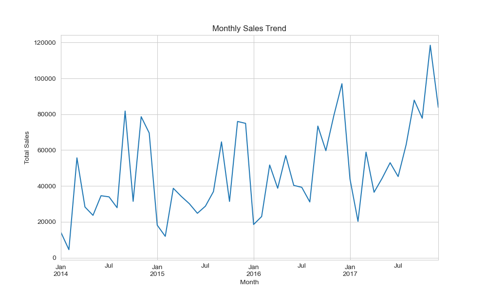
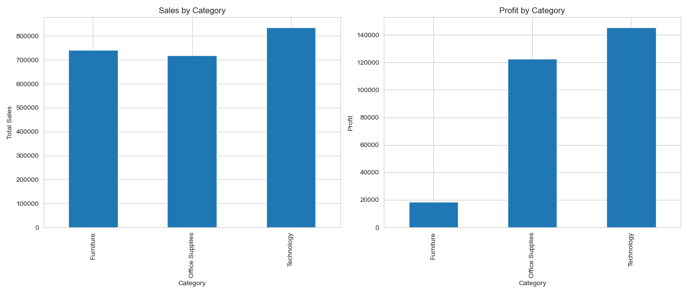
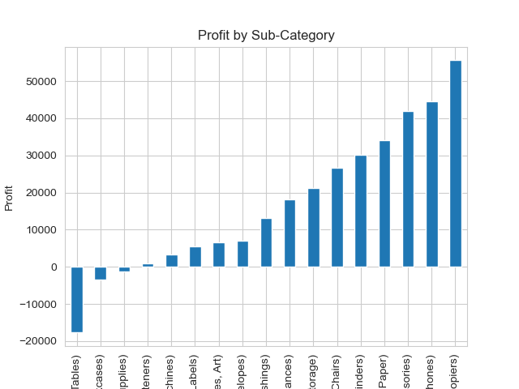
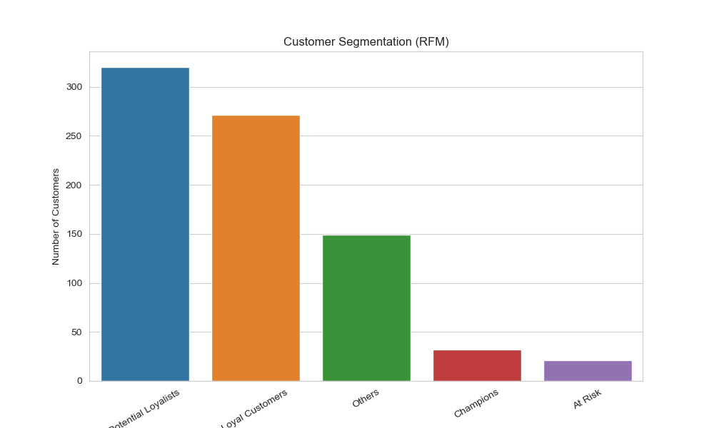

#  E-Commerce Customer & Sales Analysis

##  Project Overview

This project analyzes an e-commerce dataset to uncover insights related to:

• Sales trends over time  
• Product category performance  
• Profitability analysis  
• Customer segmentation using RFM  

The goal is to generate actionable business insights using Python.

---

##  Tools & Technologies Used

• Python  
• Pandas  
• NumPy  
• Matplotlib  
• Seaborn  
• Jupyter Notebook  

---

##  Project Structure
```
Ecommerce_Sales_and_Customer_Analysis/
│
├── Ecommerce_Sales_and_Customer_Analysis.ipynb
├── Sample - Superstore.csv
├── images/
│ ├── monthly_sales.png
│ ├── category_profit.png
│ ├── subcategory_profit.png
│ ├── rfm_segments.png
│ └── segment_revenue.png
└── README.md
```


---

## 📊 Key Visualizations

### 📈 Monthly Sales Trend


---

### 💰 Sales vs Profit by Category


---

### 📉 Profit by Sub-Category


---

### 👥 Customer Segmentation (RFM)



---

## 🔍 Key Analysis Performed

###  Sales Trend Analysis
• Analyzed monthly sales patterns  
• Identified fluctuations and seasonality  

---

###  Category & Profit Analysis
• Compared sales vs profit across categories  
• Identified that high sales ≠ high profit  

---

###  Sub-Category Deep Dive
• Detected loss-making products (e.g., Tables, Bookcases)  
• Identified high-profit products (e.g., Copiers, Phones)  

---

###  Regional Analysis
• Evaluated profit across regions  
• Highlighted differences in geographic performance  

---

###  Customer Segmentation (RFM)
• Segmented customers based on behavior  
• Identified:
  - Champions  
  - Loyal Customers  
  - At-risk Customers  

---

##  Key Business Insights

• Revenue and profitability are not always aligned  

• Certain sub-categories generate losses despite strong sales  

• Technology products are the primary profit drivers  

• A small group of customers contributes a large portion of revenue  

• Customer segmentation enables targeted marketing strategies  

• Regional differences highlight the need for localized business strategies  

---

##  Conclusion

This project demonstrates how data analysis can be used to:

• Identify profit drivers  
• Detect business inefficiencies  
• Understand customer behavior  
• Support data-driven decision-making  


---

##  Author

**Shashwat Krishna**  
Aspiring Data Analyst  

Skills:  
SQL • Python • Data Analysis • Machine Learning (Basics)

---
